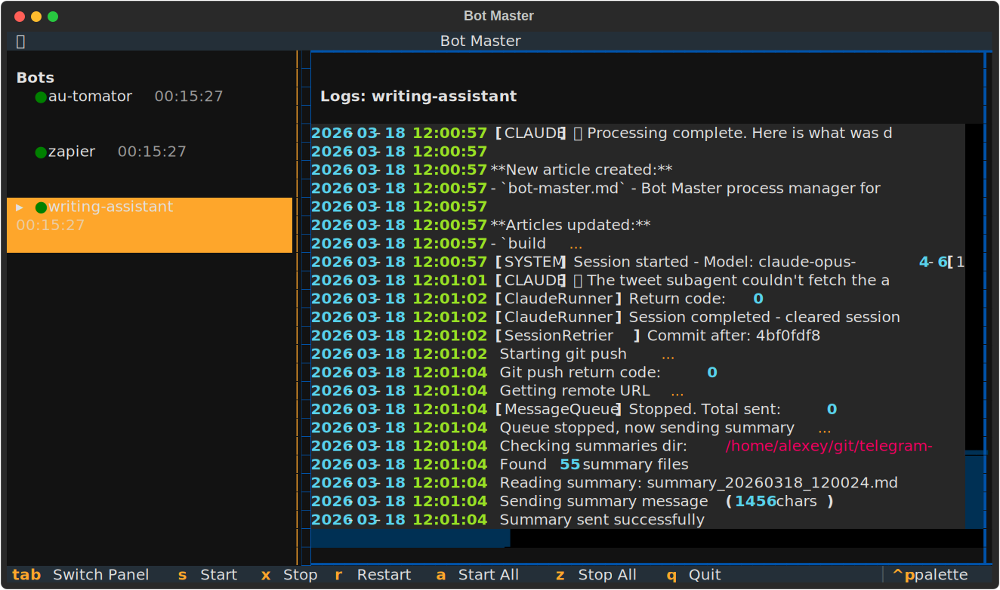

# Bot Master

A process manager for Telegram bots with a terminal UI. Runs as a background daemon (survives reboots via systemd) with a Textual TUI client for monitoring.



## Architecture

- **Daemon** (`bot-master-daemon`) — manages bot subprocesses, auto-restarts on crash (exponential backoff), buffers logs in memory and writes to disk. Communicates via Unix socket.
- **TUI Client** (`bot-master`) — connects to the daemon to view live status, stream logs, and send start/stop/restart commands. If the TUI crashes, bots keep running.

## Quick Start (prod)

```bash
uvx bot-master install
```

This interactive wizard will:
1. Ask where to store config and logs (default: `~/bots/bot-master`)
2. Create a `bots.yaml` template
3. Generate a systemd service file

Then follow the printed next steps to finish setup (install the tool globally, enable the service).

### Connect to the dashboard

```bash
bot-master          # if installed via uv tool install
uvx bot-master      # without global install
```

If the daemon isn't running, it will tell you how to start it.

## Dev Setup

For development, use the local source directly:

```bash
cd ~/bots/bot-master
uv sync
./install.sh                       # installs systemd service pointing to local .venv
uv run bot-master                  # connect TUI
```

Changes to the source take effect after restarting the daemon:

```bash
sudo systemctl restart bot-master
```

## Configuration

Edit `bots.yaml`:

```yaml
bots:
  my-bot:
    directory: /path/to/bot
    command: uv run python main.py

  another-bot:
    directory: /path/to/another-bot
    command: uv run python main.py
```

The daemon automatically loads environment variables from `.envrc` and `.env` files in each bot's directory. This means `export TELEGRAM_TOKEN=...` style files work out of the box — no need for direnv or manual sourcing.

## systemd Service

The install wizard (`uvx bot-master install`) or dev script (`./install.sh`) generates a service file. To install it manually:

```bash
sudo cp ~/bots/bot-master/bot-master.service /etc/systemd/system/
sudo systemctl daemon-reload
sudo systemctl enable --now bot-master
```

This ensures the daemon starts on boot and auto-restarts on failure.

### Manual daemon start (without systemd)

```bash
bot-master-daemon [path/to/bots.yaml]
```

## TUI Keybindings

| Key | Action |
|-----|--------|
| `s` | Start selected bot |
| `x` | Stop selected bot |
| `r` | Restart selected bot |
| `a` | Start all bots |
| `z` | Stop all bots |
| arrows / `j`/`k` | Navigate bot list |
| `tab` | Switch focus between bot list and logs |
| `q` | Quit TUI (daemon keeps running) |

## Logs

Logs are stored in the `logs/` directory (one file per bot, 10 MB rotation with 5 backups):

```
logs/
  au-tomator.log
  zapier.log
  writing-assistant.log
```

The daemon also keeps the last 5000 lines per bot in memory for fast streaming to the TUI.

## Uninstall

```bash
# Stop and remove the systemd service
sudo systemctl stop bot-master
sudo systemctl disable bot-master
sudo rm /etc/systemd/system/bot-master.service
sudo systemctl daemon-reload

# Remove the global tool (if installed)
uv tool uninstall bot-master

# Remove config and logs (optional)
rm -rf ~/bots/bot-master
```

## Environment Variables

| Variable | Default | Description |
|----------|---------|-------------|
| `BOT_MASTER_SOCK` | `/tmp/bot-master.sock` | Unix socket path |
| `BOT_MASTER_CONFIG` | `bots.yaml` | Config file path |
| `BOT_MASTER_LOG_DIR` | `logs` | Log directory path |
